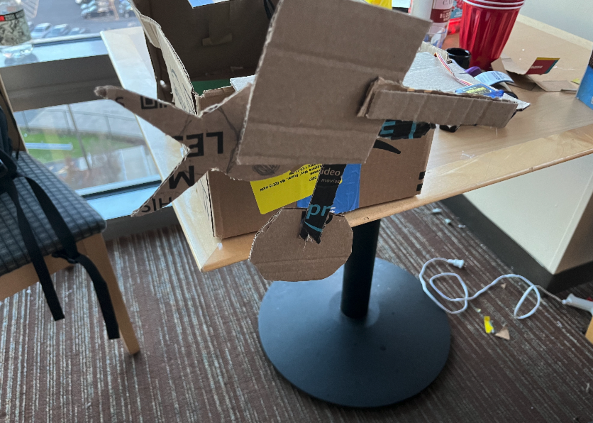
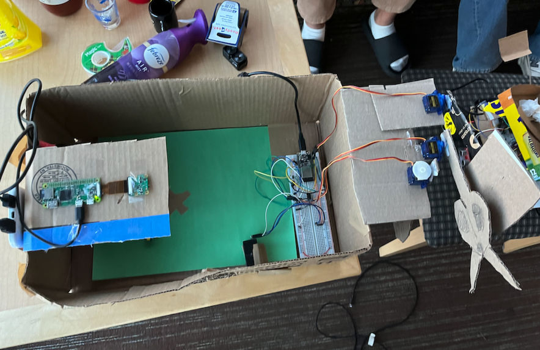

# Rock-Paper-Scissors Game

Authors: Sam Qiu, Kevin Chen, Arthur Hua

Date: 2024-05-01

### Summary

In our project, we applied our acquired skills to integrate a LiDAR, servos, picam, and ESP32 with our customized gaming box. The LiDAR enables us to gauge distances to players's hand so that the ESP knows the player is engaging in the game. Once the player makes a move, the picam captures the image and sends it to the computer python code to detect the player's gesture. We trained a model using TensorFlow to recognize the gestures and send the corresponding move back to the ESP32. The ESP32 then moves the servos to display the gesture on the gaming box. Furthermore, the python code communicates with a node server to display the game result on a website. This project demonstrates the integration of hardware and software to create an interactive gaming experience.

### Self-Assessment

| Objective Criterion                   | Rating | Max Value |
| ------------------------------------- | :----: | :-------: |
| Wins RPS 80% accuracy                 |   1    |     1     |
| LiDAR detects human being             |   1    |     1     |
| Servos move rock, paper, and scissors |   1    |     1     |
| Hosted on a node.js server            |   1    |     1     |
| Graph displaying wins/losses          |   1    |     1     |
| Demo point                            |   1    |     1     |

### Solution Design
We created a rock paper scissors robot that uses machine learning and modeling to recognize the hand signal and then output the correct hand symbol to beat the player. The design included a picam that sends the image to the laptop that has a trained model from a dataset that we made to recognize the hand signal, which goes to the node server and graphs the number of each signal. We used a lidar sensor to recognize when a hand is in the box to start the game.

### Sketches/Diagrams

### Supporting Artifacts (videos)

- [Practical Demo](https://youtu.be/a7bO4mtawac?si=rgMchcH5fxp89IlV).
- [Technical Demo](https://youtu.be/oRFYfuodzg4?si=ynhsRrulpUfaukf1).
### investigative question
How could you improve this design with more sophisticated technology or different methods? 
A: I would collect more varied data in a more diverse amount of lighting schemes to make the model more robust and accurate. Additionally I would change the lidar to be replaced with an additional complexity in the model that recognizes when there is no hand in frame rather than simply deciding between rock paper and scissors. Find a way to have higher voltage to be able to support three servos more effectively as the esp seems unable to handle the third servo without chatter. 

